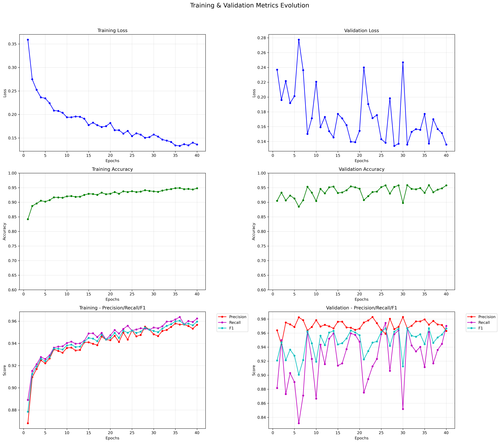
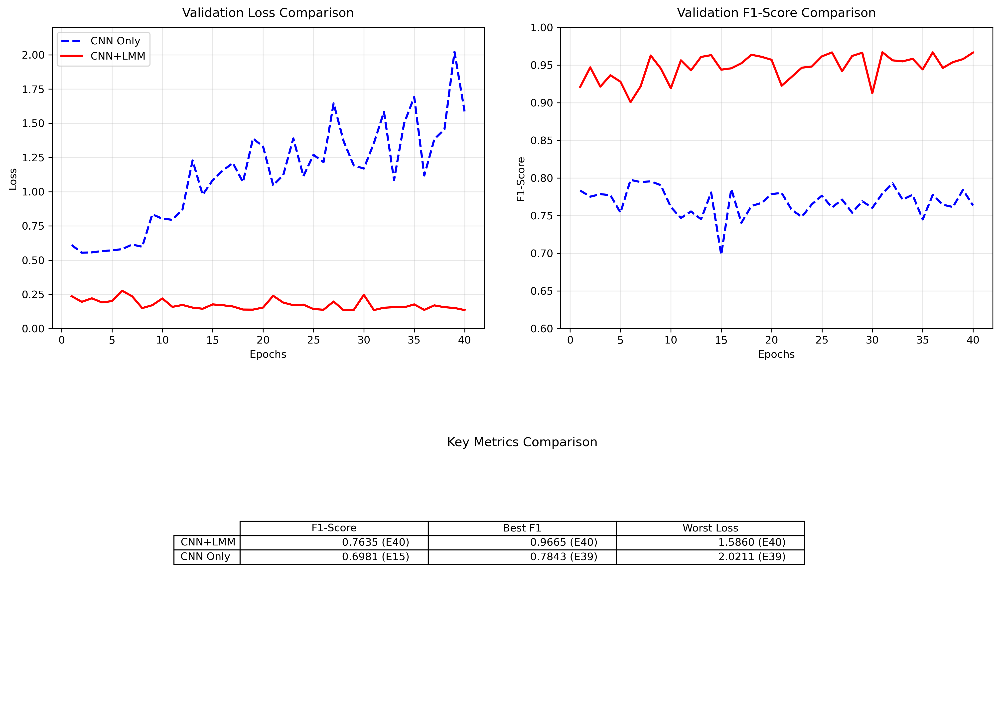

# CNN+LLM
This project is aimed at researching if combining a textual (non-multimodal) LLM (to read the report of a patient) with a CNN (to analyse the X-ray images corresponding to the reports) gives a better result at binary classification of the lung/heart diseases as compared to a CNN alone.

The output from the CNN and LLM is converted into a vector embedding that's input into a Multi-Layer-Perceptron which outputs a classification.

## Data
Indiana University Chest X-ray dataset was used in the project.
The dataset contains 7,470 pairs of images and reports and measures 14.19 GB.
IU X-ray (Demner-Fushman et al., 2016) can be accessed [here](https://www.kaggle.com/datasets/raddar/chest-xrays-indiana-university)

## LLM Model

BioBERT tokenizer was used to process and convert the words in the reports into vector embeddings. BioBERT has 110 Million parameters.
It's been proven that BioBERT can more accurately recognize medical entities and their context. Refer to the research paper [here](https://arxiv.org/abs/1901.08746#:~:text=the%20same%20architecture%20across%20tasks%2C,analysis%20results%20show%20that%20pre)

## CNN Model

The architecture of EfficientNet-B1 is used to process and convert the images into vector embeddings. EfficientNet-B1 is a Depp CNN pretrained on Medical dataset (ImageNet) and has ~6.5 Million trainable parameters. EfficientNet‑B1 component is fine‑tuned on the dataset I used, while the BioBERT model remains frozen. I've leveraged pre‑trained knowledge from both models but only updated the image branch and the fusion MLP during training. It's been proven that EfficientNet architecture gives slightly better accuracy per parameter. Refer to the research paper [here](https://arxiv.org/pdf/1905.11946)

## Multi-Layer Perceptron

The outputs from EfficientNet‑B1 (≈1280‑dimensional) and BioBERT (≈768‑dimensional) are concatenated and then fed into a two‑layer MLP (with a hidden layer of 256 units) that produces the final binary classification.
A dropout rate of 0.3 was incorporated in the fusion MLP layer of the CNN+LLM architecture to mitigate overfitting by randomly deactivating 30% of the neurons during training.

## Parameters

| Parameters | Specification |
| --- | --- |
| Optimizer | Adam |
| Learning Rate | 0.003 |
| Number of Epochs | 40 |
| Drop out rate (Regularization) | 0.3 |
| Train / Test data ratio | 80 : 20 |

## Results

| Epoch | Phase | Loss    | Accuracy | Precision | Recall  | F1-Score |
|-------|-------|---------|----------|-----------|---------|----------|
| 1     | Train | 0.3590  | 0.8421   | 0.8681    | 0.8891  | 0.8785   |
|       | Val   | 0.2370  | 0.9050   | 0.9639    | 0.8817  | 0.9209   |
| 2     | Train | 0.2748  | 0.8871   | 0.9095    | 0.9152  | 0.9124   |
|       | Val   | 0.1961  | 0.9331   | 0.9439    | 0.9499  | 0.9469   |
| 3     | Train | 0.2524  | 0.8958   | 0.9169    | 0.9212  | 0.9191   |
|       | Val   | 0.2216  | 0.9063   | 0.9750    | 0.8731  | 0.9213   |
| 4     | Train | 0.2362  | 0.9052   | 0.9248    | 0.9277  | 0.9263   |
|       | Val   | 0.1919  | 0.9230   | 0.9724    | 0.9030  | 0.9364   |
| 5     | Train | 0.2344  | 0.9022   | 0.9221    | 0.9259  | 0.9240   |
|       | Val   | 0.2012  | 0.9130   | 0.9687    | 0.8902  | 0.9278   |
| 6     | Train | 0.2239  | 0.9072   | 0.9264    | 0.9293  | 0.9278   |
|       | Val   | 0.2775  | 0.8849   | 0.9824    | 0.8316  | 0.9007   |
| 7     | Train | 0.2083  | 0.9169   | 0.9346    | 0.9361  | 0.9353   |
|       | Val   | 0.2363  | 0.9070   | 0.9784    | 0.8710  | 0.9216   |
| 8     | Train | 0.2074  | 0.9166   | 0.9332    | 0.9371  | 0.9352   |
|       | Val   | 0.1502  | 0.9531   | 0.9637    | 0.9616  | 0.9626   |
| 9     | Train | 0.2036  | 0.9156   | 0.9316    | 0.9374  | 0.9345   |
|       | Val   | 0.1713  | 0.9331   | 0.9687    | 0.9232  | 0.9454   |
| 10    | Train | 0.1940  | 0.9203   | 0.9359    | 0.9403  | 0.9381   |
|       | Val   | 0.2206  | 0.9043   | 0.9783    | 0.8667  | 0.9192   |
| 11    | Train | 0.1940  | 0.9213   | 0.9362    | 0.9416  | 0.9389   |
|       | Val   | 0.1593  | 0.9458   | 0.9693    | 0.9435  | 0.9562   |
| 12    | Train | 0.1956  | 0.9185   | 0.9336    | 0.9397  | 0.9367   |
|       | Val   | 0.1731  | 0.9304   | 0.9717    | 0.9158  | 0.9429   |
| 13    | Train | 0.1950  | 0.9190   | 0.9341    | 0.9400  | 0.9371   |
|       | Val   | 0.1539  | 0.9511   | 0.9696    | 0.9520  | 0.9607   |
| 14    | Train | 0.1910  | 0.9250   | 0.9409    | 0.9423  | 0.9416   |
|       | Val   | 0.1455  | 0.9538   | 0.9667    | 0.9595  | 0.9631   |
| 15    | Train | 0.1774  | 0.9290   | 0.9410    | 0.9489  | 0.9449   |
|       | Val   | 0.1772  | 0.9317   | 0.9761    | 0.9136  | 0.9438   |
| 16    | Train | 0.1825  | 0.9282   | 0.9396    | 0.9491  | 0.9443   |
|       | Val   | 0.1712  | 0.9337   | 0.9762    | 0.9168  | 0.9456   |
| 17    | Train | 0.1772  | 0.9253   | 0.9384    | 0.9457  | 0.9420   |
|       | Val   | 0.1620  | 0.9411   | 0.9681    | 0.9371  | 0.9523   |
| 18    | Train | 0.1733  | 0.9329   | 0.9462    | 0.9494  | 0.9478   |
|       | Val   | 0.1397  | 0.9545   | 0.9677    | 0.9595  | 0.9636   |
| 19    | Train | 0.1750  | 0.9275   | 0.9434    | 0.9436  | 0.9435   |
|       | Val   | 0.1391  | 0.9511   | 0.9646    | 0.9574  | 0.9609   |
| 20    | Train | 0.1818  | 0.9293   | 0.9429    | 0.9473  | 0.9451   |
|       | Val   | 0.1544  | 0.9465   | 0.9663    | 0.9478  | 0.9569   |
| 21    | Train | 0.1665  | 0.9349   | 0.9468    | 0.9520  | 0.9494   |
|       | Val   | 0.2400  | 0.9076   | 0.9751    | 0.8753  | 0.9225   |
| 22    | Train | 0.1666  | 0.9292   | 0.9413    | 0.9489  | 0.9450   |
|       | Val   | 0.1905  | 0.9210   | 0.9779    | 0.8945  | 0.9343   |
| 23    | Train | 0.1593  | 0.9375   | 0.9498    | 0.9530  | 0.9514   |
|       | Val   | 0.1716  | 0.9351   | 0.9828    | 0.9126  | 0.9464   |
| 24    | Train | 0.1649  | 0.9349   | 0.9434    | 0.9559  | 0.9496   |
|       | Val   | 0.1756  | 0.9364   | 0.9741    | 0.9232  | 0.9480   |
| 25    | Train | 0.1539  | 0.9379   | 0.9517    | 0.9515  | 0.9516   |
|       | Val   | 0.1431  | 0.9518   | 0.9646    | 0.9584  | 0.9615   |
| 26    | Train | 0.1599  | 0.9349   | 0.9463    | 0.9525  | 0.9494   |
|       | Val   | 0.1383  | 0.9578   | 0.9591    | 0.9744  | 0.9667   |
| 27    | Train | 0.1571  | 0.9364   | 0.9476    | 0.9536  | 0.9506   |
|       | Val   | 0.1983  | 0.9297   | 0.9804    | 0.9062  | 0.9418   |
| 28    | Train | 0.1503  | 0.9412   | 0.9550    | 0.9533  | 0.9542   |
|       | Val   | 0.1341  | 0.9525   | 0.9656    | 0.9584  | 0.9620   |
| 29    | Train | 0.1517  | 0.9389   | 0.9525    | 0.9523  | 0.9524   |
|       | Val   | 0.1369  | 0.9578   | 0.9689    | 0.9638  | 0.9663   |
| 30    | Train | 0.1573  | 0.9372   | 0.9482    | 0.9543  | 0.9512   |
|       | Val   | 0.2469  | 0.8976   | 0.9828    | 0.8518  | 0.9126   |
| 31    | Train | 0.1529  | 0.9357   | 0.9466    | 0.9536  | 0.9501   |
|       | Val   | 0.1358  | 0.9585   | 0.9670    | 0.9670  | 0.9670   |
| 32    | Train | 0.1465  | 0.9399   | 0.9512    | 0.9554  | 0.9533   |
|       | Val   | 0.1530  | 0.9458   | 0.9704    | 0.9424  | 0.9562   |
| 33    | Train | 0.1443  | 0.9431   | 0.9521    | 0.9596  | 0.9558   |
|       | Val   | 0.1567  | 0.9444   | 0.9766    | 0.9339  | 0.9548   |
| 34    | Train | 0.1415  | 0.9451   | 0.9548    | 0.9598  | 0.9573   |
|       | Val   | 0.1558  | 0.9485   | 0.9767    | 0.9403  | 0.9582   |
| 35    | Train | 0.1341  | 0.9483   | 0.9579    | 0.9616  | 0.9598   |
|       | Val   | 0.1772  | 0.9324   | 0.9794    | 0.9115  | 0.9442   |
| 36    | Train | 0.1332  | 0.9489   | 0.9570    | 0.9637  | 0.9604   |
|       | Val   | 0.1372  | 0.9585   | 0.9720    | 0.9616  | 0.9668   |
| 37    | Train | 0.1367  | 0.9449   | 0.9570    | 0.9572  | 0.9571   |
|       | Val   | 0.1701  | 0.9344   | 0.9773    | 0.9168  | 0.9461   |
| 38    | Train | 0.1344  | 0.9457   | 0.9556    | 0.9601  | 0.9578   |
|       | Val   | 0.1568  | 0.9431   | 0.9723    | 0.9360  | 0.9538   |
| 39    | Train | 0.1400  | 0.9437   | 0.9533    | 0.9593  | 0.9563   |
|       | Val   | 0.1513  | 0.9478   | 0.9715    | 0.9446  | 0.9578   |
| 40    | Train | 0.1361  | 0.9479   | 0.9567    | 0.9624  | 0.9596   |
|       | Val   | 0.1358  | 0.9578   | 0.9630    | 0.9701  | 0.9665   |

## Conclusion

The model generalised well without underfitting or overfitting. The valuation loss has consistently decreased and the valuation parameters are an indication of a remarkable ability of the combined model of LLM and CNN. When compared to CNN alone (repository here), LLM+CNN is far better, as CNN tends to overfit. Below is a visual representation.

